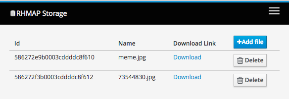

# RHMAP File Storage Service

Store and retrieve your files without hassle using mongodb gridfs storage engine

## Why using mongodb as storage solution

- When using mongo data and files are stored in one place (simplicity)
- Easy to scale using mongo mechanisms
- Easy to backup using existing mongo backup solutions
- Easy to monitor storage and provide alerts

## Web interface

## API

> POST /api/files/

Upload file using formdata. File input should be named `file` 

> GET /api/files/:filename

Stream uploaded file

> DELETE /api/files/:filename

Delete uploaded file (file id can be used as well)